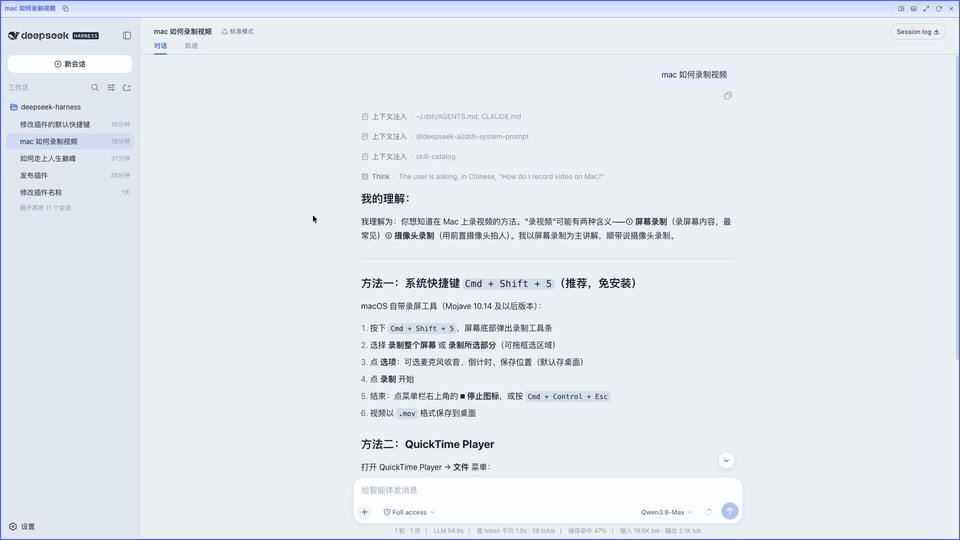
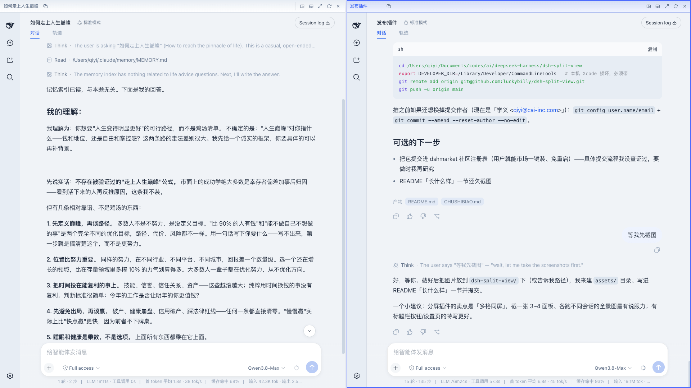
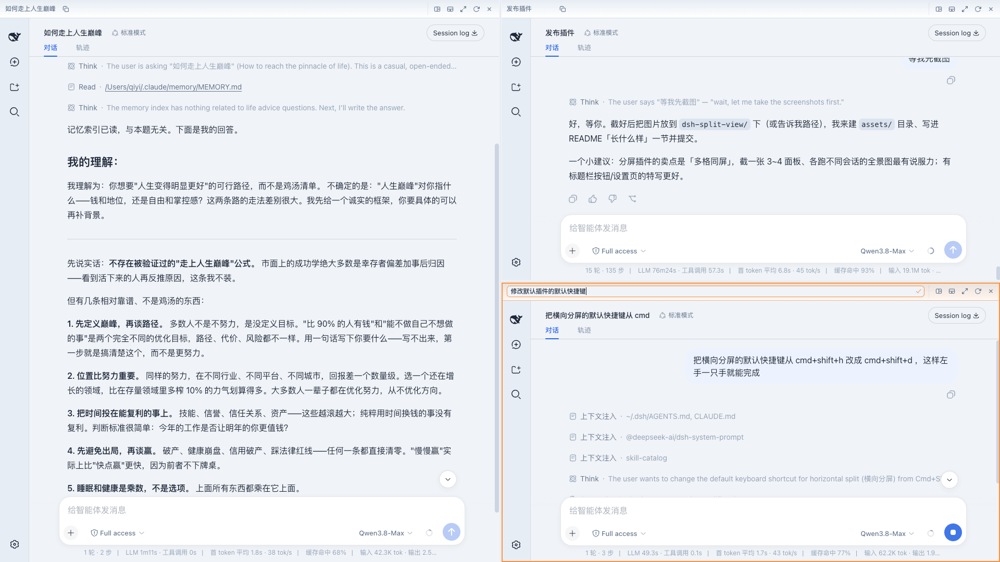

# dsh-split-view

[中文](README.md) | English

One plugin that turns the DeepSeek Harness main window into split panes, so you can watch several sessions at once.

If you have ever run several tasks at the same time, you know the pain: switching between tabs over and over.

dsh-split-view borrows the idea of terminal splitting. The DSH main window becomes a draggable split container, and each pane runs a full DSH client of its own.

## What it looks like



Above is daily use: split right, split down, drag the divider, double-click the title bar to maximize, close.







Horizontal and vertical splits nest freely. Every pane has a title bar: the live session title on the left, and five buttons on the right — split right, split down, maximize/restore, reload, close. Click the title to rename the session, double-click to maximize, and copy "session id + session title" with one click.

## Install

```sh
dsh plugin --profile web add dsh-split-view
dsh web   # restart to activate
```

Install from source for local development: `dsh plugin --profile web add -w /path/to/dsh-split-view`.

Uninstall with `dsh plugin --profile web remove dsh-split-view`, restart, and the window is back to normal. If the plugin itself breaks, boot stops with an error instead of a silent blank page, so uninstalling is also the emergency recovery path.

## Default shortcuts (customizable in Settings)

| Key (⌘ on macOS, Ctrl on Windows/Linux) | Action |
|---|---|
| ⇧⌘D | Split right |
| ⇧⌘V | Split down |
| ⇧⌘X | Close focused pane |
| ⇧⌘Enter | Maximize / restore focused pane |

## Settings

Open Settings from any pane; the navigation on the left has a "Split View" entry.

Four groups:

- **Shortcuts**: click the combo of an action to start recording, press the new combo to rebind, Esc to cancel. What you bind is up to you: combos taken by the browser or the OS, or combos that collide with another action, still bind — you get a warning, not a block. The only hard rule is that a combo must include ⌘/Ctrl.
- **Focus highlight color**: the outline and title-bar tint of the focused pane. Preset palette, a custom color picker, plus "Follow theme" — follows the brand color token of the current skin, so it changes when you switch skins.
- **Title bar**: one switch hides all pane title bars. Note that the title bar carries the copy-session-info, split, maximize, reload and close buttons, and double-click-to-maximize and click-title-to-rename also live there — with it hidden, those actions are keyboard-only. Clicking a pane to focus it is unaffected.
- **Restore defaults**: resets everything above; asks for confirmation first.

## For other plugins

The whole split-view capability is exposed as a Cordis service: pane operations, pane×session operations (load a given session, send a message, rename, switch model, cancel a turn), plus queries and subscriptions. See [api.md](./api.md) for the service API aimed at integrators.

## License

MIT © dsh-split-view contributors
